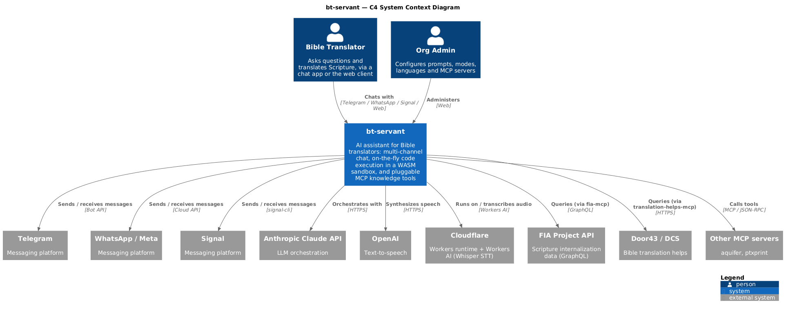
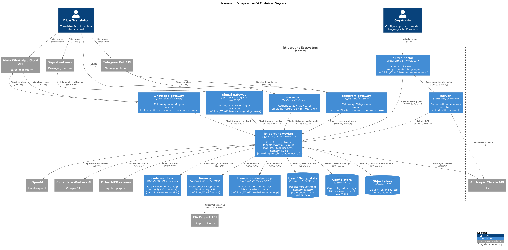

# bt-servant ecosystem — architecture

Architecture diagrams for the bt-servant multi-repo ecosystem, reverse-engineered from the
source of each repo on 2026-06-29. Two [C4](https://c4model.com/) levels are provided:

1. **System Context** — what bt-servant is and the outside world it touches.
2. **Container** — the repos/services inside the ecosystem and how they wire together.

---

## Level 1 — System Context



A single **bt-servant** system, two kinds of user, and the external systems it integrates with.
Bible translators reach it over Telegram, WhatsApp, Signal, or the web; org admins configure it
over the web. Downstream it depends on Anthropic Claude (orchestration), OpenAI (TTS), Cloudflare
(Workers runtime + Whisper STT), and external knowledge sources reached through MCP servers
(FIA Project API, Door43/DCS, aquifer, ptxprint).

## Level 2 — Container



`bt-servant-worker` is the hub (the "engine" at `api.btservant.ai`, formerly `bt-servant-engine`).
Everything else either feeds messages into it, drives its admin API, or is called by it. The worker
also runs Claude-generated JavaScript on the fly in an in-process **QuickJS/WASM sandbox**.

### The repos

All under `github.com/unfoldingWord/<name>` (nodes in the SVG link to them directly).

| Repo                            | Role                                                                                                                                                         | Stack                                 |
| ------------------------------- | ------------------------------------------------------------------------------------------------------------------------------------------------------------ | ------------------------------------- |
| **bt-servant-worker**           | Core AI orchestrator: Claude loop, dynamic MCP tool discovery, sandboxed code exec, per-user/group memory (Durable Objects), org config (KV), TTS/voice (R2) | TypeScript, Cloudflare Worker         |
| **bt-servant-telegram-gateway** | Thin relay between Telegram and the worker                                                                                                                   | TypeScript, CF Worker                 |
| **bt-servant-whatsapp-gateway** | Thin relay between Meta/WhatsApp and the worker                                                                                                              | TypeScript, CF Worker                 |
| **bt-servant-signal-gateway**   | Long-running relay between Signal and the worker                                                                                                             | Python/FastAPI on Fly.io + signal-cli |
| **bt-servant-web-client**       | Authenticated chat web UI                                                                                                                                    | Next.js on Cloudflare Workers         |
| **bt-servant-admin-portal**     | Admin UI for users, prompts, modes, languages                                                                                                                | React SPA + CF Worker BFF             |
| **baruch**                      | Conversational AI admin assistant; edits worker config via its admin API                                                                                     | TypeScript, CF Worker                 |
| **fia-mcp**                     | MCP server wrapping the FIA internalization GraphQL API (6 tools); called by the worker as an MCP client                                                     | TypeScript, CF Worker                 |
| **translation-helps-mcp**       | MCP server exposing Door43/DCS Bible translation helps (scripture, notes, words, questions); called by the worker as an MCP client                           | TypeScript, CF Worker                 |

The **code sandbox** node in the container diagram is not a separate repo — it is the worker's
in-process QuickJS/WASM runtime (`@cf-wasm/quickjs`, 30 s timeout) that executes Claude-generated JS.

### Key flows

- **Channels → worker**: the three gateways forward inbound messages to `POST /api/v1/chat` /
  `/chat/callback` (Bearer `ENGINE_API_KEY`); the worker answers asynchronously by POSTing back to
  each gateway's `/progress-callback`. The four "ways into BTS" are Telegram, WhatsApp, Signal, and
  the web client.
- **UIs → worker**: `web-client` calls the chat API; `admin-portal` calls the admin API _and_
  proxies to `baruch`.
- **baruch → worker**: one-way; manages prompt overrides, modes, and MCP-server config.
- **worker → downstream**: Anthropic Claude (orchestration), OpenAI (TTS), Cloudflare Workers AI
  (Whisper STT), the in-process WASM code sandbox, and MCP servers (`fia-mcp`,
  `translation-helps-mcp`, aquifer, ptxprint).
- **worker → data stores** (Cloudflare-managed, shown as cylinders):
  - **Durable Objects** (`USER_DO`, SQLite) — per-user/group/thread memory, history, preferences, mode
  - **KV** — org config, admin keys, MCP-server registry, prompt overrides
  - **R2** — TTS audio, USFM sources, generated PDFs

---

## Files

| File                                         | What                                                  |
| -------------------------------------------- | ----------------------------------------------------- |
| `bt-servant-context.puml`                    | C4 System Context source (authoritative)              |
| `bt-servant-context.svg` / `.png` / `.pdf`   | rendered System Context diagram                       |
| `bt-servant-ecosystem.puml`                  | C4 Container source (authoritative)                   |
| `bt-servant-ecosystem.svg` / `.png` / `.pdf` | rendered Container diagram                            |
| `bt-servant-ecosystem.mmd`                   | Mermaid Container source (renders natively on GitHub) |
| `bt-servant-ecosystem.mermaid.svg` / `.png`  | rendered Mermaid version                              |

> SVGs have clickable repo links and scale losslessly; PNGs embed inline (above); PDFs are for
> sharing/printing.

## Regenerating

Diagrams are rendered **locally** (nothing leaves the machine) via a local
[Kroki](https://kroki.io/) stack, also exposed to Claude Code through the
[`uml-mcp`](https://github.com/antoinebou12/uml-mcp) MCP server. Both are configured in
`../../../uml-mcp/`.

```bash
# 1. Start local Kroki (once per boot)
docker compose -f /c/Users/ianjl/code/uml-mcp/kroki-local-compose.yml up -d

# 2. Re-render after editing a .puml source.
#    NOTE: send Content-Type: text/plain — Kroki rejects urlencoded form bodies over 8 KB,
#    and PlantUML parses "<->" in label text as a formatting tag (use "to" or "/").
cd docs/architecture
for name in bt-servant-context bt-servant-ecosystem; do
  for fmt in svg png pdf; do
    curl -s -X POST "http://localhost:8000/c4plantuml/$fmt" -H "Content-Type: text/plain" \
      --data-binary @"$name.puml" -o "$name.$fmt"
  done
done

# Mermaid version
curl -s -X POST http://localhost:8000/mermaid/png -H "Content-Type: text/plain" \
  --data-binary @bt-servant-ecosystem.mmd -o bt-servant-ecosystem.mermaid.png
```

From Claude Code you can also ask it to use the **uml-mcp** server (`generate_uml` tool) — it is
registered locally and configured to render through the local Kroki stack
(`USE_LOCAL_KROKI=true`, `KROKI_SERVER=http://localhost:8000`).
